# AI Tender - System Architecture Diagram

## Main Architecture Overview

```mermaid
graph TB
    %% Frontend Layer
    User[👤 User] --> UI[React Frontend<br/>Vite + React 18]
    
    subgraph Frontend["Frontend Layer (Port 5173)"]
        UI
        UI --> Upload[📤 DocumentUpload]
        UI --> List[📋 DocumentList]
        UI --> Chat[💬 ChatInterface]
    end
    
    %% API Layer
    Upload --> API[🔌 API Service - Axios]
    List --> API
    Chat --> API
    
    API -->|HTTP/REST| Backend[⚡ FastAPI Backend<br/>Port 8000]
    
    %% Backend Routers
    subgraph Routers["API Routers"]
        DocAPI[📁 /api/documents]
        ChatAPI[💭 /api/chat]
    end
    
    Backend --> DocAPI
    Backend --> ChatAPI
    
    %% Document Processing Pipeline
    subgraph DocPipeline["Document Processing Pipeline"]
        direction TB
        DP1[1️⃣ DocumentProcessor<br/>Extract Text]
        DP2[2️⃣ Chunking<br/>1000 tokens/100 overlap]
        DP3[3️⃣ EmbeddingService<br/>BAAI/bge-m3]
        DP4[4️⃣ VectorStore<br/>Store in Qdrant]
        
        DP1 --> DP2 --> DP3 --> DP4
    end
    
    %% RAG Query Pipeline
    subgraph RAGPipeline["RAG Query Pipeline"]
        direction TB
        RG1[1️⃣ Embed Query<br/>bge-m3]
        RG2[2️⃣ Vector Search<br/>Top-K Retrieval]
        RG3[3️⃣ Build Prompt<br/>+ Context]
        RG4[4️⃣ LLM Generate<br/>Ollama]
        
        RG1 --> RG2 --> RG3 --> RG4
    end
    
    %% Connections
    DocAPI --> DocPipeline
    ChatAPI --> RAGPipeline
    
    %% External Services
    subgraph External["External Services"]
        Qdrant[(🗄️ Qdrant<br/>Vector DB<br/>localhost:6333)]
        Ollama[🤖 Ollama LLM<br/>llama3.1:8b<br/>localhost:11434]
    end
    
    DP4 --> Qdrant
    RG2 --> Qdrant
    RG4 --> Ollama
    
    %% Storage
    DocAPI --> Storage[(💾 File Storage<br/>uploads/)]
    DP1 --> Storage
    
    %% Styling
    classDef frontend fill:#E3F2FD,stroke:#2196F3,stroke-width:2px
    classDef backend fill:#E8F5E9,stroke:#4CAF50,stroke-width:2px
    classDef pipeline fill:#FFF3E0,stroke:#FF9800,stroke-width:2px
    classDef external fill:#F3E5F5,stroke:#9C27B0,stroke-width:2px
    classDef storage fill:#FCE4EC,stroke:#E91E63,stroke-width:2px
    
    class UI,Upload,List,Chat,API frontend
    class Backend,DocAPI,ChatAPI backend
    class DocPipeline,RAGPipeline,DP1,DP2,DP3,DP4,RG1,RG2,RG3,RG4 pipeline
    class Qdrant,Ollama external
    class Storage storage
```

## Component Description

### Frontend Layer (Port 5173)
- **React Frontend**: Main UI built with Vite + React 18
- **DocumentUpload**: Drag & drop interface for file uploads (PDF, DOCX, XLSX)
- **DocumentList**: Display uploaded documents with processing status
- **ChatInterface**: Q&A interface with message history and source citations
- **API Service**: Axios-based HTTP client for backend communication

### Backend Layer (Port 8000)
- **FastAPI Backend**: High-performance async REST API server
- **API Routers**:
  - `/api/documents`: Document upload, list, retrieve, delete
  - `/api/chat`: RAG-based question answering

### Document Processing Pipeline
1. **DocumentProcessor**: Extracts text from PDF/DOCX/XLSX files
2. **Chunking**: Splits text into 1000-token chunks with 100-token overlap
3. **EmbeddingService**: Generates 1024-dimensional embeddings using BAAI/bge-m3
4. **VectorStore**: Stores embeddings in Qdrant vector database

### RAG Query Pipeline
1. **Embed Query**: Converts user question to vector using bge-m3
2. **Vector Search**: Retrieves top-K most similar document chunks from Qdrant
3. **Build Prompt**: Combines user question with retrieved context
4. **LLM Generate**: Generates answer using Ollama (llama3.1:8b-instruct-q4_0)

### External Services
- **Qdrant Vector DB** (localhost:6333): Semantic search and vector storage
- **Ollama LLM** (localhost:11434): Local language model for answer generation

### Storage
- **File Storage** (uploads/): Persistent storage for uploaded documents

## Technology Stack

| Category | Technologies |
|----------|-------------|
| Frontend | React 18, Vite, Axios, react-dropzone, react-markdown |
| Backend | FastAPI, Python 3.12, Pydantic, Uvicorn |
| Document Processing | PyPDF2, python-docx, openpyxl, tiktoken |
| ML/AI | sentence-transformers (bge-m3), Ollama |
| Database | Qdrant (vector database) |
| HTTP Client | httpx (async) |

## Architecture Pattern
This system implements a **Retrieval-Augmented Generation (RAG)** pattern, combining:
- Semantic search (vector similarity)
- Large Language Models (contextual reasoning)
- Source attribution (transparent citations)

This approach ensures answers are grounded in the actual uploaded documents rather than relying solely on the LLM's training data.

